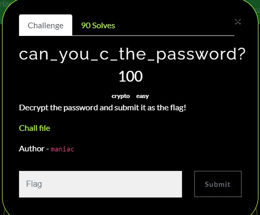
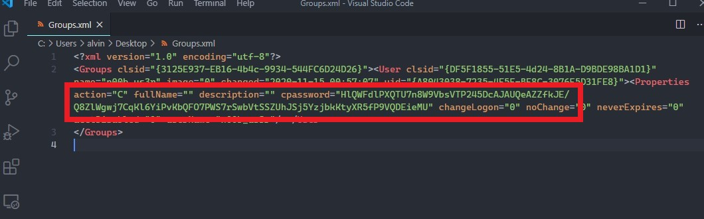
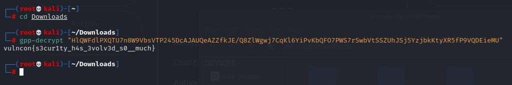

# can_you_c_the_password?
Category: Cryptography  
Level: Easy

---

### Challenge:



For this particular challenge, not much info was given from the challenge description but we need to download file from the posted link. It was a zip file with a folder named 'Policies' inside. The given folder is uploaded here as well under the folder ['challenge_file'](./challenge_file).

<br/>

### Solution:

Navigating through the folders, it appears that they are folders belonging to Active Directory. Soon, we come across the file Groups.xml which contains details like username, settings, and the most interesting one, the cpassword as highlighted in the image below. 

<br/>



The cpassword is hashed and thus we will need some way to decrypt it. After some googling, we managed to find a method to decrypt it following this [tutorial](https://inner-tech.blogspot.com/2013/07/ftp-plain-text-command-injection.html). 


In short, download this [script](https://pastebin.com/TE3fvhEh) and run it against the cpassword hash and you will get your flag like below:

<br/>




The flag is:
```
vulncon{s3cur1ty_h4s_3volv3d_s0__much}
```

<br/>

_*Take note the script 'gpprefdecrypt.py' from the pastebin is in python2 and thus you will need to modified the syntax a little if your system is running python3. Anyway, our modified script for python3 is uploaded here as well._