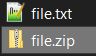
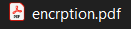
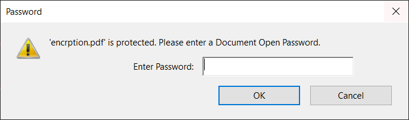
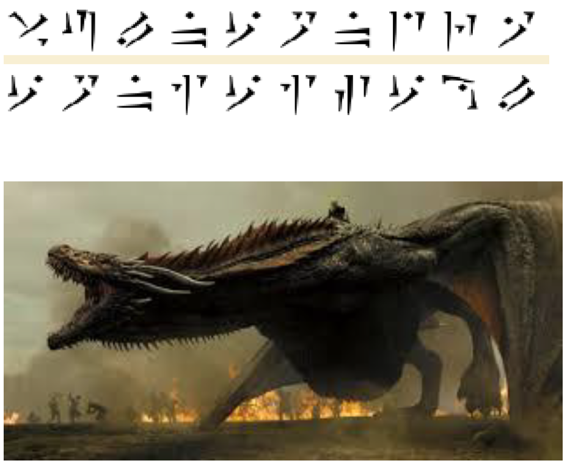

<h2 style="font-family: Raleway,RalewayOffline,sans-serif;font-weight: 500;letter-spacing: 2px;text-align:center;">All I know was zip</h2>
<div style="text-align:center;">
	<span style="font-family: Lato,LatoOffline,sans-serif;">misc</span>
	<span style="font-family: Lato,LatoOffline,sans-serif;">easy</span>
</div>


---

<h2 style="font-family: Raleway,RalewayOffline,sans-serif;font-weight: 500;letter-spacing: 2px;text-align:center;">Challenge</h2>

<div style="text-align:left;">
	<span style="font-family: Lato,LatoOffline,sans-serif;">
		<p>My friend mailed me some hex numbers and told that, It's a zip. Can you help me to covert the these numbers to zip and get the flag?</p>
		<p>note:- all letters are lowercase and underscore between words formate:-<code>vulncon{}</code></p>
		<p>File: <a href="./file/file.txt">file.txt</a></p>
		<p>Author - <code>_5h4rk_</code></p>
	</span>
</div>


---

<h2 style="font-family: Raleway,RalewayOffline,sans-serif;font-weight: 500;letter-spacing: 2px;text-align:center;">Solution</h2>

1. As hinted, we can infer that the file is a hex dump of a zip file. Opening the file in a texteditor confirms this:


   ```bash
   0x50, 0x4B, 0x03, 0x04, 0x14, 0x00, 0x00, 0x00, 0x08, 0x00, 0x6A, 0x5A, 0x85, 0x51, 0xC4, 0xDC
   ...
```

   
   
   ```bash
   ...
   0x50, 0x4B, 0x05, 0x06, 0x00, 0x00, 0x00, 0x00, 0x01, 0x00, 0x01, 0x00, 0x53, 0x00, 0x00, 0x00, 
   0xDD, 0x89, 0x00, 0x00, 0x00, 0x00
```

   Note: zip files has a header that starts with `50 4B 03 04` (source: https://en.wikipedia.org/wiki/ZIP_(file_format))

   

2. We can convert the hex dump to a binary file using `xxd`:

   ```bash
xxd -r -p file.txt file.zip
```

   Output:

   

   


   Opening the file reveals a PDF file:

   

   

   Opening the `encrption.pdf` shows that the file is password protected:

   

   Now, we have to figure out the password.

   

3. We can use an online PDF password cracker (https://www.ilovepdf.com/unlock_pdf) which will give an unlocked copy of the pdf.

   Opening the file we get a some cipher text and a picture of a dragon:
   
   

   

   

4. After some searching, we found the [cipher decoder](https://www.dcode.fr/draconic-dragon-language)

   ```bash
   VULNCONDRA
   CONICISCOOL
```

   Output:

   ```bash
   vulncon{draconic_is_cool}
```

   
