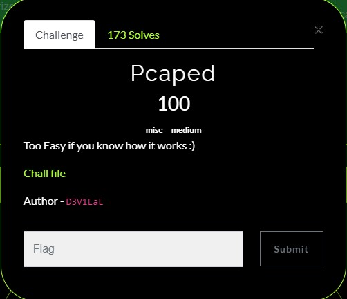
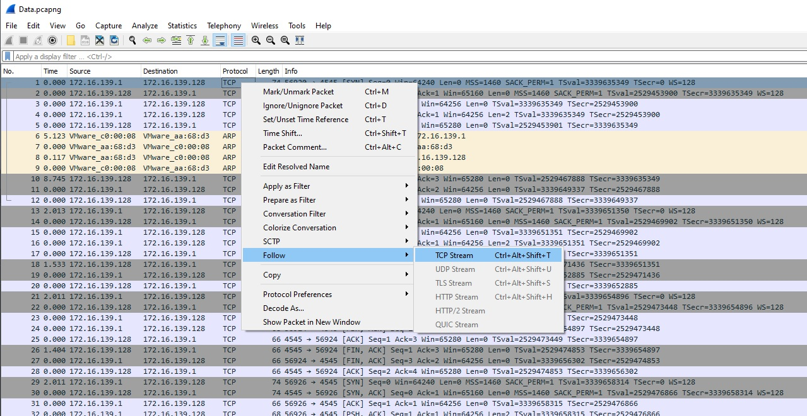
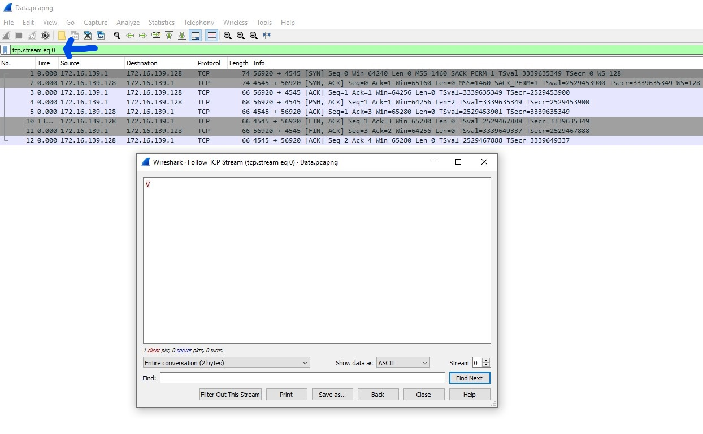
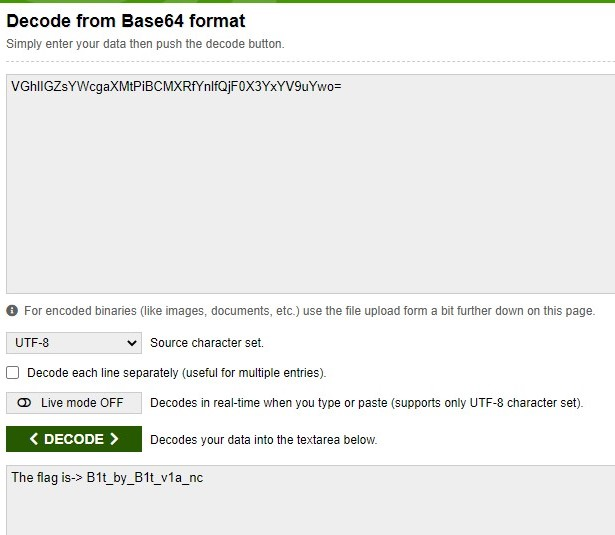

# Pcaped
Category: Miscellaneous  
Level: Medium

---

### Challenge:



Above is the challenge and without much info, we are only given a link to download a .pcapng file which contains dump of data packets captured over a network and is a file type associated with Wireshark.

<br/>

### Solution:

Go ahead to download the .pcapng (attached in packet folder) file and open it in Wireshark.  

Follow the TCP stream as shown in image below:


This chunks of TCP stream followed is a complete TCP handshake between two hosts from starting to termination of session.

After following the TCP stream you will get to this page as shown below:


Here we are given a character 'V'. Note this down somewhere as we will need it later on. Now notice the blue arrow? Just need to increment the number and we can retrieve each characters sent between the two hosts. Increment the number up til 44 and the whole sequence of characters as follow:

```
VGhlIGZsYWcgaXMtPiBCMXRfYnlfQjF0X3YxYV9uYwo=
```

Looking at these characters, I remembered I read somewhere that mentioned if you saw an equal sign behind some long random text, it normally indicates it's a base64. Hence I dumped the whole string into a base64 decoder website and gotten the flag!



The flag is:
```
vulncon{B1t_by_B1t_v1a_nc}
```