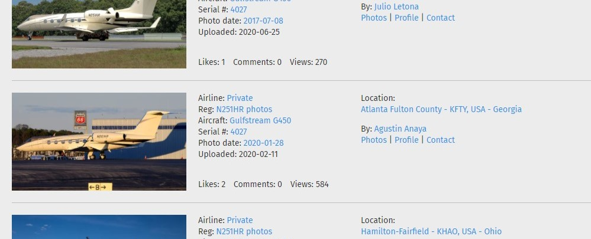

# The Watcher
Category: OSINT  
Level: Hard

---

### Challenge:


This time round we need to help tim3zapper to find the email address of a famous photographer. Some useful hints to follow might be the the handle tim3zapper, famous photographer, and airline event.

<br/>

### Solution:


As usual, the first step is to lookup at the handle 'tim3zapper' and see what can we gather about this person. A quick search using Sherlock landed us on this twitter account - [tim3zapper](https://twitter.com/tim3zapper).

One particular tweet caught our attention.


It was mentioned that Twitter deleted his previous tweet, so we thought that might be a clue to the next step. Thus, using the Wayback Machine website, we tried to see if that particular deleted tweet managed to be archived by the Wayback Machine or not. Luckily, we managed to retrieve the deleted tweet as per image below:


The deleted tweet:

```
Thanks, @sullyth3h4x0r for saving my data from that intruder. Thanks a billion!!

If you want a 1337 h4x0r like Sully, then contact his friend lmao
```
<br/>

There we got our next clue, a handle called sullyth3h4x0r. Using Sherlock, we landed on this page, https://ello.co/sullyth3h4x0r, with two post like the image below.


And there we got a post of an airplane and the caption asking us to find the owner of that photograph. So that must be it!

Quickly, we do reverse google image search by uploading that airplane photograph to google to look up where could that image possibly comes from.


And we found one that looks exactly like the plane photograph as highlighted in image above. Clicking into that link, we now know that the photographer is someone called Agustin Anaya. However, the contact's link not able to reveal the email address due to some privacy concern.




Hence, our search for this Agustin Anaya's contact continues. 

After some time searching, we finally come to this page, http://www.dutchops.com/photo_big.asp?id=728, where we are able to retrieve the email address when clicking on the 'Contact Photographer' link where it launch the Outlook app and give us the email address aka flag.


The flag is:
```
vulncon{m.venema@dutchops.com}
```