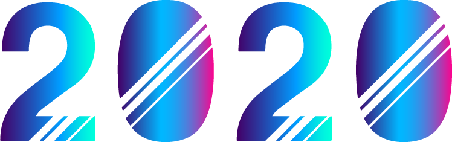

	
	

  
  
  
  

---

This repo contains solutions that my team yolo and I had solved in [VULNCON CTF 2020](https://ctf.noobarmy.org/challenges) which was held on the 19th and 20th December 2020.

We managed to get 89th place out of 442 teams.

Listed below are our stats:

	
	  
	
	
	  
	
	  
	

  

