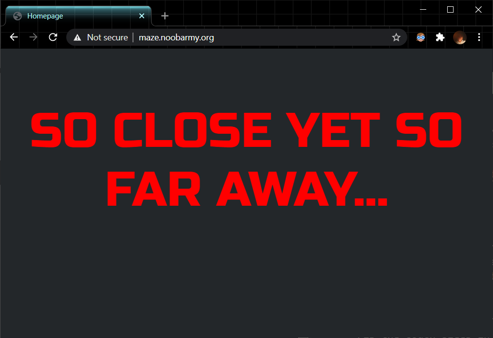
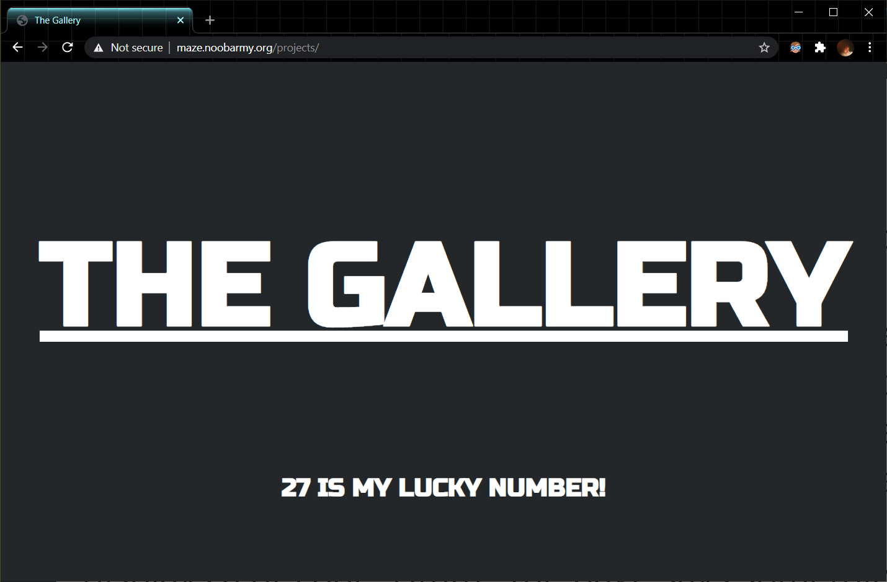
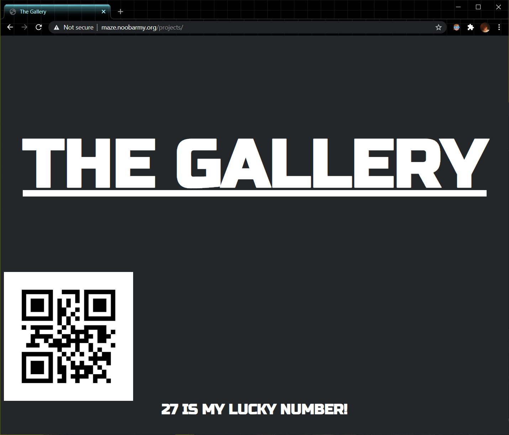
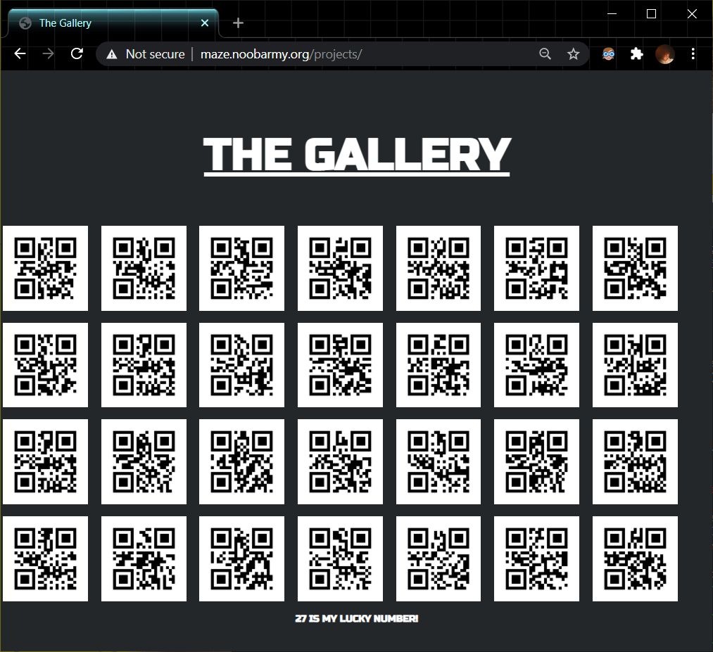

<h2 style="font-family: Raleway,RalewayOffline,sans-serif;font-weight: 500;letter-spacing: 2px;text-align:center;">Maze</h2>
<div style="text-align:center;">
	<span style="font-family: Lato,LatoOffline,sans-serif;">web</span>
	<span style="font-family: Lato,LatoOffline,sans-serif;">easy</span>
</div>

---

<h2 style="font-family: Raleway,RalewayOffline,sans-serif;font-weight: 500;letter-spacing: 2px;text-align:center;">Challenge</h2>

<div style="text-align:left;">
	<span style="font-family: Lato,LatoOffline,sans-serif;">
		<p>So close yet so far away... Can you help John to get out of the maze?</p>
		<p>Note: You can use <code>Gobuster</code></p>
		<p>Link: <a href="http://maze.noobarmy.org/">http://maze.noobarmy.org/</a></p>
		<p>Author - <code>Umair</code></p>
	</span>
</div>

---

<h2 style="font-family: Raleway,RalewayOffline,sans-serif;font-weight: 500;letter-spacing: 2px;text-align:center;">Solution</h2>

1. Go to [http://maze.noobarmy.org/](http://maze.noobarmy.org/)

   

   

2. As hinted, use <code>Gobuster</code> to brute-force URIs to the website. (Note: `Gobuster` is available in Kali by default, otherwise you may download [here](https://github.com/OJ/gobuster))

   We use the default dirbuster wordlist `common.txt` (you may download [here](https://github.com/digination/dirbuster-ng/blob/master/wordlists/common.txt))

   Command line might look like this:

   ```text
   gobuster dir -u http://maze.noobarmy.org/ -w /usr/share/wordlists/common.txt
   ```

   Output:

   ```text
   ===============================================================
   Gobuster v3.0.1
   by OJ Reeves (@TheColonial) & Christian Mehlmauer (@_FireFart_)
   ===============================================================
   [+] Url:            http://maze.noobarmy.org/
   [+] Threads:        100
   [+] Wordlist:       /usr/share/wordlists/common.txt
   [+] Status codes:   200,204,301,302,307,401,403
   [+] User Agent:     gobuster/3.0.1
   [+] Timeout:        10s
   ===============================================================
   2020/12/21 13:16:33 Starting gobuster
   ===============================================================
   /.htaccess (Status: 403)
   /.htpasswd (Status: 403)
   /.hta (Status: 403)
   /index.php (Status: 200)
   /projects (Status: 301)
   /server-status (Status: 403)
   ===============================================================
   2020/12/21 13:16:53 Finished
   ===============================================================
   ```

   This shows that there exists a directory called **projects**.

   

3. Go to [http://maze.noobarmy.org/projects/](http://maze.noobarmy.org/projects/)

   

   

4. Inspect the website.

    ```html
    <html>
      <head>
        <title> The Gallery </title>
        <link rel="preconnect" href="https://fonts.gstatic.com">
        <link href="https://fonts.googleapis.com/css2?family=Russo+One&display=swap" rel="stylesheet">
      </head>
    <body style="font-size: 150px; font-family: 'Russo One'; font-weight: bold; background-color: #23272A; color: white;">

     <center><p style="margin-top: 200px;"><u>THE GALLERY</u></p></center>
     <!--

     

     -->
     <center style="font-size: 32px;">27 IS MY LUCKY NUMBER!</center> 
    </body>
    </html>
    ```

   We notice that there is an `img` tag that is commented.
   
   

5. Uncomment the `img` tag.

   This would reveal a QR code.

   

   
   
6. Scanning the QR code gives us the message: `Hello`
   
   However, this does solve anything. There must be another clue.
   
   > <b>27 IS MY LUCKY NUMBER!</b>
   
   Looking at the source code again: `` hints us to check for `image-27` which indeed exists.
   
   In fact, the title of the website "THE GALLERY" also hints to use that there must be a photo gallery.
   
   
   
7. Insert images 0 to 27 to the source.

   ```html
   
   
   
   
   
   
   
   
   
   
   
   
   
   
   
   
   
   
   
   
   
   
   
   
   
   
   
   
   ```

   We will get the following output:

   

   

8. Scanning all the QR codes reveals the following message:

   > Hello and welcome to this challenge! We hope that collecting these images was not that hard for you, anyways just so you know i love the number 13

   This hints to use that there is something in `image-13.png`.
   
   
   
9. Download `image-13.png` 

    

    

    <div style="text-align:center"><a href="./img/image-13.png">Link</a></div>

   

10. Run ExifTool on `image-13.png`.

    ```bash
    exiftool image-13.png
    ```

    Output:

    ```text
    ExifTool Version Number         : 12.12
    File Name                       : image-13.png
    Directory                       : .
    File Size                       : 946 bytes
    File Modification Date/Time     : 2020:12:21 13:57:18+08:00
    File Access Date/Time           : 2020:12:21 14:07:14+08:00
    File Inode Change Date/Time     : 2020:12:21 14:06:36+08:00
    File Permissions                : rwxrwxrwx
    File Type                       : PNG
    File Type Extension             : png
    MIME Type                       : image/png
    Image Width                     : 290
    Image Height                    : 290
    Bit Depth                       : 1
    Color Type                      : Grayscale
    Compression                     : Deflate/Inflate
    Filter                          : Adaptive
    Interlace                       : Noninterlaced
    XMP Toolkit                     : Image::ExifTool 12.04
    Creator                         : aWh5YXBiYXtqQCRfN3UxJF8zaTNhX0BfajNvX3B1QHl5M2F0Mz99
    Image Size                      : 290x290
    Megapixels                      : 0.084
    ```

    This reveals a suspicious string:

    ```text
    aWh5YXBiYXtqQCRfN3UxJF8zaTNhX0BfajNvX3B1QHl5M2F0Mz99
    ```

    

11. Decode `aWh5YXBiYXtqQCRfN3UxJF8zaTNhX0BfajNvX3B1QHl5M2F0Mz99` from Base64 gives us:

    ```text
    ihyapba{j@$_7u1$_3i3a_@_j3o_pu@yy3at3?}
    ```

    This looks like some cipher.

    

12. Using Caesar Cipher gives us the flag:

    ```text
    vulncon{w@$_7h1$_3v3n_@_w3b_ch@ll3ng3?}
    ```

    

